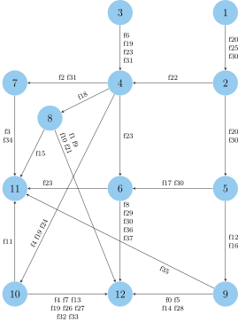

> Figure 11, 12, 13, 14

<figure>

<figcaption>Topology</figcaption>
</figure>



<h2>Packet Rate</h2>


<figure>

<figcaption style="display: flex; justify-content: center;">Repeat {{forloop.index0}}</figcaption>
</figure>


<h2>Worst Case</h2>


<figure>

<figcaption style="display: flex; justify-content: center;">Repeat {{forloop.index0}}</figcaption>
</figure>




<h2>Flow {{flow}}</h2>



<figure>

<figcaption style="display: flex; justify-content: center;">Repeat {{forloop.index0}}</figcaption>
</figure>




